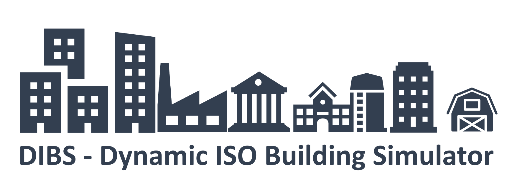

# DibsComuptingCore

Dynamic ISO Building Simulator (DIBS) is a simulation program for calculating the space heating, occupancy hot water, cooling and electricity demand of German non-residential buildings. Further the DIBS calculates the heating value based energy uses, the primary energy and the greenhouse gas emission based on the defined factors of the German building energy ordinance (Gebäudeenergiegesetz). The adapted hourly dynamic building energy simulator for single buildings and building stocks is ready to use with [ENOB:dataNWG interview](https://www.datanwg.de/stichprobenerhebung/breitenerhebung) and [on-site inspection](https://www.datanwg.de/stichprobenerhebung/tiefenerhebung) data. The underlying resistance-capacity-model is based on the simplified hourly method of ISO 13790:2008. DIBS is based on the [RC_BuildingSimulator](https://github.com/architecture-building-systems/RC_BuildingSimulator) and represents an extension of capabilities and adaptation to the requirements of the ENOB:dataNWG project.

## Getting Started

Python packages you need to use DIBS:
- [>= Python 3.10.0](https://www.python.org/)

## Installation
To install the package, use the following command:

```bash
pip install dibs_computing_core==1.0.0
```

## Further information

For a detailed installation guide and further information on DIBS see the [wiki](https://github.com/IWUGERMANY/DIBS---Dynamic-ISO-Building-Simulator/wiki)

## References
- DIN EN ISO 13790:2008-09. Energieeffizienz von Gebäuden - Berechnung des Energiebedarfs für Heizung und Kühlung (ISO 13790:2008). Berlin: Beuth Verlag.
- Jayathissa, P. (2020). 5R1C Building Simulation Model. URL: https://github.com/architecture-building-systems/RC_BuildingSimulator  
- DIN V 18599, 2016: DIN V 18599-1 - Energetische Bewertung von Gebäuden - Berechnung des Nutz-, End- und Primärenergiebedarfs für Heizung, Kühlung, Lüftung, Trinkwarmwasser und Beleuchtung.
- SIA 2024, 2015: SIA 2024 - Raumnutzungsdaten für die Energie- und Gebäudetechnik.
- Quaschning, Volker; Hanitsch, Rolf (1995): SHADE CALCULATIONS IN PHOTOVOLTAIC SYSTEMS. in ISES Solar World Conference - Harare / Zimbabwe - September 11-15, 1995. In ISES Solar World Conference 1995. Available online at https://www.researchgate.net/publication/242728998_SHADE_CALCULATIONS_IN_PHOTOVOLTAIC_SYSTEMS, checked on 3/8/2022.
- Crawley, Drury B.; Barnaby, Charles S. (2019): Weather and climate in building performance simulation. In Jan L.M. Hensen, Roberto Lamberts (Eds.): Building Performance Simulation for Design and Operation. Second edition. | Abingdon, Oxon, New York, NY : Routledge, 2019.: Routledge, pp. 191–220.
-climate.onebuilding.org (2023): \climatewebsite\WMO_Region_6_Europe\DEU_Germany. Available online at https://climate.onebuilding.org/WMO_Region_6_Europe/DEU_Germany/index.html, updated on 9/16/2023, checked on 12/13/2023.
-GEG2020 (2020): Gesetz zur Vereinheitlichung des Energieeinsparrechts für Gebäude und zur Änderung weiterer Gesetze. Vom 8. August 2020. In Bundesanzeiger 2020 (Bundesgesetzblatt Teil I Nr. 37), pp. 1728–1794. Available online at https://www.bgbl.de/xaver/bgbl/text.xav?SID=&tf=xaver.component.Text_0&tocf=&qmf=&hlf=xaver.component.Hitlist_0&bk=bgbl&start=%2F%2F*%5B%40node_id%3D%27941169%27%5D&skin=pdf&tlevel=-2&nohist=1&sinst=6C6E28BB.
- Szokolay, Steven V. (2008): Introduction to architectural science. The basis of sustainable design. 2. ed. Amsterdam, Heidelberg: Architectural Press.
- BMWE and BMIBH (4/15/2021): Bekanntmachung der Regeln für Energieverbrauchswerte und der Vergleichswerte im Nichtwohngebäudebestand, revised BAnz AT 5/3/2021 B1. In : Bekanntmachung. Available online at https://www.bundesanzeiger.de/pub/publication/GZb2vlJQJe1XCpSyM6h?0, checked on 7/19/2021.
- DIN 4108-2, Februar 2013: Thermal protection and energy economy in buildings.
- Hörner, Michael; Knissel, Jens; Bagherian, Behrooz; Born, Rolf; Grafe, Michael; Jedek, Christoph; Loga, Tobias (2014): Teilenergiekennwerte von Nichtwohngebäuden (TEK). Berechnungsgrundlagen des TEK-Tools Version TEK 6.2. Darmstadt: IWU. Available online at http://www.iwu.de/fileadmin/user_upload/dateien/energie/tektool/TEK-Methodik_6.2_final_ISBN.pdf.


---

## Publications
- Bischof, Julian; Knoll, Simon; Duffy, Aidan (2022): DEVELOPMENT OF A PYTHON-BASED SIMPLIFIED HOURLY BUILDING MODEL FOR NON-DOMESTIC BUILDING STOCK OPERATIONAL ENERGY SIMULATIONS. In the proceedings of the BauSIM 2022 in Weimar, 20. – 22. September 2022. In: BauSIM2022 2022. URL: https://www.researchgate.net/publication/364386249_DEVELOPMENT_OF_A_PYTHON-BASED_SIMPLIFIED_HOURLY_BUILDING_MODEL_FOR_NON-DOMESTIC_BUILDING_STOCK_OPERATIONAL_ENERGY_SIMULATIONS.

---

## Usage

import dibs-computing-core

The Dynamic ISO Building Simulator has been developed in context of the 'ENOB:DataNWG Forschungsdatenbank Nichtwohngebäude' (www.datanwg.de) project and the project 'FlexGeber - Demonstration of flexibility options in the building sector and their integration with the energy system in Germany' at Institut Wohnen und Umwelt (IWU), Darmstadt.
<p float="left">
   
</p>  

<b>ENOB:DataNWG<b>
<b>Funding code:</b>  Fkz.: 03ET1315  
<b>Project duration:</b>  01.12.2015 until 31.05.2021

<b>FlexGeber<b>
<b>Funding code:</b>  Fkz.: 03EGB0001  
<b>Project duration:</b>  01.10.2017 until 31.07.2022

<b>ENOB:LezBAU<b>
<b>Funding code:</b>  Fkz.: 03EN1074A
</br><b>Project duration:</b>  01.01.2023 until 31.12.2025
  
<b>All funded by:</b> 
<p float="left">
   
</p> 
in accordance with the parliamentary resolution of the German Parliament.

